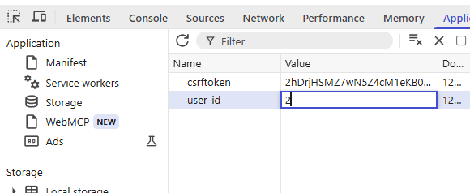
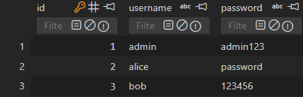
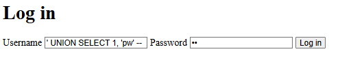
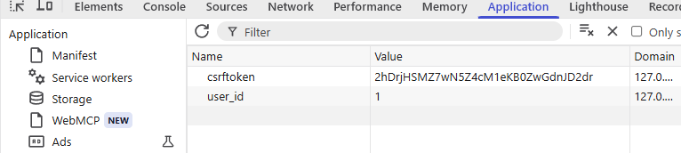
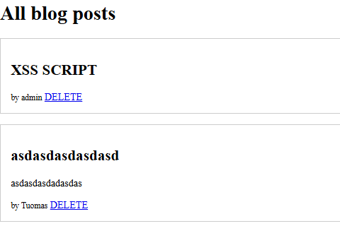
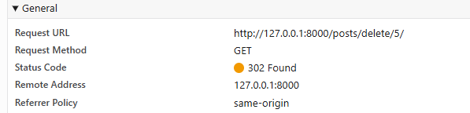
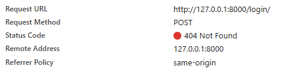
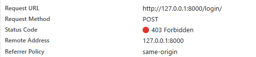

# Cyber-Security-project

Project for the course Cyber Security Base 2026

# LISTED SECURITY FAILURES

### 1. Broken Access Control

Problem: Identity of user is carried on a tamperable user_id cookie. Changing it makes you appear as another user.



FIX: Used Djangos server side sessions. Now changing client-side cookie bounces to login.

### 2. Cryptographic Failures.

Problem: Passwords are stored as plaintext in database. If a hacker gets them they immediately see passwords.



FIX: Using hashing on all passwords.

### 3. Injection.

Problem: Insecure query on logging in. Allows for SQL injections.

```python
with connection.cursor() as cursor:
            cursor.execute(
                f"SELECT id, password FROM core_user WHERE username = '{username}' LIMIT 1",
                [],
            )
            row = cursor.fetchone()
```

1. In username field write:' UNION SELECT 1, 'pw' --
2. In password field write: pw

   

3. Press login

   

4. Now logged in
   Also you can inject Scripts in to the post body since:

```html
<p>{{ blog.body|safe }}</p>
```


The hidden bodytext contains: <script>fetch('/posts/delete/5/')</script>
Which when viewed by the author of post "asdasdasdasdasd" will delete it.
Requires refreshing the website.



FIX: Remove the |safe tag.

### 4. Identification & Authentication Failures

Problem: Insecure password allowed. Username enumeration is easy with distinct error messages for wrong password vs no user.

FIX:

- Strict passwords required: +6 char and 1 digit.
- Hashing.
- One generic not authorized instead of multiple.
- Timing equialization. (Hash a password even if user not found.)

Example:
Username: None existent
Password: Password
Result:



2nd Example:
Username: admin
Password: hmmmm
Result:



### 5. Security Logging & Monitoring Failures

Problem: Nothing logs to an external service. Only place to see failed logins or such is on the host console.

# INCOMPLETE

- Add fix and screenshot
