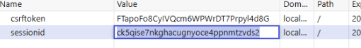
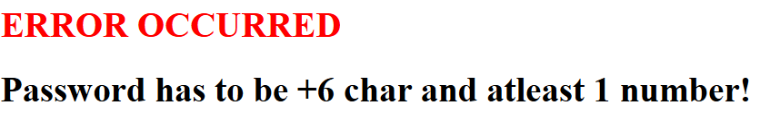
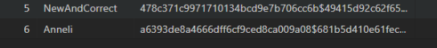
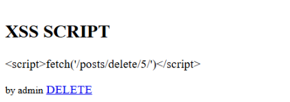
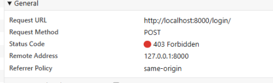
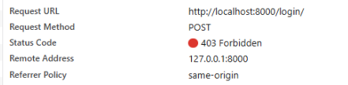
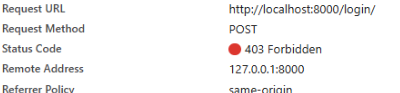
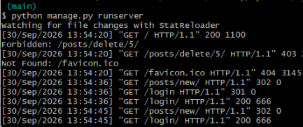

# Cyber-Security-project

Project for the course Cyber Security Base 2026

## Running the app

### 1. Clone the repository

```bash
git clone https://github.com/<your-username>/Cyber-Security-project.git
cd Cyber-Security-project
```

### 2. Create and activate a virtual environment

```bash
python -m venv venv
# Windows:
venv\Scripts\activate
# macOS / Linux:
source venv/bin/activate
```

### 3. Install dependencies

```bash
pip install django
```

### 4. Build the database

If migrations and the database file aren't tracked in git, create them:

```bash
python manage.py makemigrations core
python manage.py migrate
```

Otherwise:

```bash
python manage.py migrate
```

### 5. Run the development server

```bash
python manage.py runserver
```

# LISTED SECURITY FAILURES

### 1. Broken Access Control

Problem: Identity of user is carried on a tamperable user_id cookie. Changing it makes you appear as another user.
Sub problem: No CSRF token on delete POST request. This is covered later in injection section.


FIX: Used Djangos server side sessions. Now changing client-side cookie is rejected.



### 2. Cryptographic Failures.

Problem: Passwords are stored as plaintext in database. If a hacker gets them they immediately see passwords.


FIX: Using hashing on all passwords.

Side note I also demand stronger passwords:



Now passwords are stored as hashses. Much more difficult to get through



### 3. Injection.

Problem: Insecure query on logging in. Allows for SQL injections.

```python
with connection.cursor() as cursor:
            cursor.execute(
                f"SELECT id, password FROM core_user WHERE username = '{username}' LIMIT 1",
                [],
            )
            row = cursor.fetchone()
```

1. In username field write:' UNION SELECT 1, 'pw' --
2. In password field write: pw

   

3. Press login

   

4. Now logged in

Also you can inject Scripts in to the post body since:

```html
<p>{{ blog.body|safe }}</p>
```


The hidden bodytext contains: <script>fetch('/posts/delete/5/')</script>
Which when viewed by the author of post "asdasdasdasdasd" will delete it.
Requires refreshing the website.


FIX(CSS): Remove the |safe tag. Change the GET method to POST so it has CSRF key included
After removing the safe tag. The body text isn't treated as a script and renders as text:



FIX(SQL): Parametrize the query so users can't inject anything in to it.
Technically the checks already force that specific injection to not work.
But if we remove them for a test we find that injection no longer works.



### 4. Identification & Authentication Failures

Problem: Insecure password allowed. Username enumeration is easy with distinct error messages for wrong password vs no user.

Example:
Username: None existent
Password: Password
Result:


2nd Example:
Username: admin
Password: hmmmm
Result:


FIX:

- Strict passwords required: +6 char and 1 digit. (Covered in part 1)
- Hashing. (Covered in part 1)
- One generic not authorized instead of multiple.
- Timing equialization. (Hash a password even if user not found.)

1st example revisited with fix:



2nd example revisited with fix:



Now enumerating users is much harder

### 5. Security Logging & Monitoring Failures

Problem: Nothing logs to an external service. Only place to see failed logins or such is on the host console.
Logs also lack any relevant information like IP.



FIX: add logging that stores important details to a file. Ideally you would want to host another service like tracing to do this.
But for the purpose of this course it gets stored in security.log.

This example came about from natural testing:

```
2026-09-30 14:04:16,099 WARNING Failed register username='NewAndCorrect' ip=REMOVED_FROM_SCREENSHOT
2026-09-30 14:12:59,279 INFO Successful login user_id=7 ip=REMOVED_FROM_SCREENSHOT
2026-09-30 14:13:23,033 INFO Successful login user_id=7 ip=REMOVED_FROM_SCREENSHOT
2026-09-30 14:13:23,110 WARNING Attempted to use incorrect method on delete: GET, ip=REMOVED_FROM_SCREENSHOT, post=5
2026-09-30 14:14:39,986 WARNING Attempted to use incorrect method on delete: GET, ip=REMOVED_FROM_SCREENSHOT, post=5
2026-09-30 14:15:31,577 WARNING Failed login username="' UNION SELECT 1, 'pw' --" ip=REMOVED_FROM_SCREENSHOT
2026-09-30 14:23:34,180 WARNING Failed login username='None existent' ip=REMOVED_FROM_SCREENSHOT
2026-09-30 14:30:48,418 WARNING Attempted to log to none existent user username='DOesnt Exist' ip=REMOVED_FROM_SCREENSHOT
2026-09-30 14:31:24,840 WARNING Incorrect password on login username='admin' ip=REMOVED_FROM_SCREENSHOT
```

- 2 Attempted incorrect method on delete come from the XSS script that was stored as a post.
- First failed login shows the username used in the SQL injection attempt.

Since this is still a part of the same program it is possibly vulnerable to being deleted by a party that gains access to it.
That should be fixed when creating production software.
